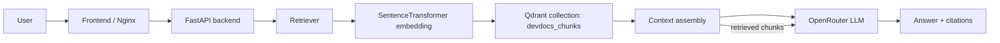

# DevDocs RAG

DevDocs RAG is a documentation question-answering application that indexes selected documentation sources, embeds them into a vector database, and answers user questions by retrieving relevant passages and grounding the response in the retrieved documentation.

This repository contains the backend API, a lightweight frontend UI, Docker Compose services for the application stack, and ingestion code that discovers, fetches, extracts, chunks, embeds, and indexes official documentation content for retrieval.

## Overview

The application is split into three main parts:

- A FastAPI backend that serves the retrieval and generation pipeline
- A static frontend app served by Nginx
- A Qdrant vector database used for similarity search

The project is designed around a document corpus restricted to allowlisted official documentation sources, not a general-purpose internet crawl.

## Key features

- Documentation-only RAG pipeline with allowlisted sources
- FastAPI API for health checks and question answering
- Retrieval over a persisted Qdrant collection using embeddings
- Support for multiple documentation sources: FastAPI, Python, React, Docker, and Qdrant
- Local ingestion workflow for fetching and indexing documentation pages
- Prompt-based generation through OpenRouter
- Source URL validation and citation filtering to reduce fabricated references
- Docker Compose setup for local development and service orchestration

## How the RAG pipeline works

The code in `backend/app/rag/service.py` wires together the three stages of the request flow:

1. Retrieval: the query is embedded and searched against Qdrant
2. Context assembly: the best matching chunks are filtered, deduplicated, and limited by token budget
3. Generation: the assembled context is passed to the LLM, and the returned answer is validated against retrieved source URLs

The flow is effectively:

User
→ Frontend
→ FastAPI backend
→ Retriever
→ Qdrant vector search
→ Context assembly
→ LLM via OpenRouter
→ Answer + source citations



## System architecture

The repository currently implements a local stack with explicit service boundaries:

| Component          | Runtime                     | Role                                                           |
| ------------------ | --------------------------- | -------------------------------------------------------------- |
| Frontend           | Nginx in Docker             | Hosts the static chat UI                                       |
| Backend            | FastAPI + Uvicorn in Docker | Accepts queries, retrieves context, generates answers          |
| Qdrant             | `qdrant/qdrant:latest`      | Stores chunk vectors and metadata                              |
| Ingestion pipeline | Python scripts/modules      | Discovers, fetches, extracts, chunks, embeds, and indexes docs |
| OpenRouter         | External API                | LLM generation backend                                         |

The backend service is configured in `docker-compose.yml` and the actual app entrypoint is `backend/app/main.py`.

## Technology stack

| Area                    | Technology                             |
| ----------------------- | -------------------------------------- |
| API                     | FastAPI                                |
| ASGI server             | Uvicorn                                |
| Frontend                | Static HTML/JavaScript served by Nginx |
| Vector database         | Qdrant                                 |
| Embeddings              | Sentence Transformers + BGE embeddings |
| LLM provider            | OpenRouter                             |
| Document fetching       | `httpx` + custom fetch/robots logic    |
| Parsing                 | BeautifulSoup                          |
| Configuration           | `pydantic-settings`                    |
| Container orchestration | Docker Compose                         |
| Tests                   | `pytest`                               |

The Python dependencies are defined in `backend/requirements.txt`:

- `beautifulsoup4`
- `qdrant-client`
- `sentence-transformers`
- `fastapi`
- `uvicorn[standard]`
- `pydantic-settings`

## Project directory structure

```text
.
├── .env.example
├── .gitignore
├── docker-compose.yml
├── README.md
├── backend/
│   ├── Dockerfile
│   ├── requirements.txt
│   ├── run_ingestion.py
│   ├── app/
│   │   ├── __init__.py
│   │   ├── main.py
│   │   ├── api/
│   │   │   ├── deps.py
│   │   │   ├── routes/
│   │   │   │   ├── health.py
│   │   │   │   └── rag.py
│   │   │   └── schemas/
│   │   │       └── rag.py
│   │   ├── core/
│   │   │   └── config.py
│   │   ├── generation/
│   │   │   ├── client.py
│   │   │   ├── errors.py
│   │   │   ├── generator.py
│   │   │   ├── models.py
│   │   │   └── prompt.py
│   │   ├── ingestion/
│   │   │   ├── __init__.py
│   │   │   ├── catalog.py
│   │   │   ├── catalog_models.py
│   │   │   ├── chunker.py
│   │   │   ├── document_models.py
│   │   │   ├── embedder.py
│   │   │   ├── extract.py
│   │   │   ├── fetcher.py
│   │   │   ├── http_client.py
│   │   │   ├── ids.py
│   │   │   ├── indexer.py
│   │   │   ├── links.py
│   │   │   ├── normalize.py
│   │   │   ├── orchestrator.py
│   │   │   ├── rate_limit.py
│   │   │   ├── registry.py
│   │   │   ├── retry.py
│   │   │   ├── robots.py
│   │   │   ├── sanitize.py
│   │   │   ├── sitemap.py
│   │   │   ├── sources/
│   │   │   ├── tokenize.py
│   │   │   ├── url_security.py
│   │   │   └── ...
│   │   ├── rag/
│   │   │   ├── models.py
│   │   │   └── service.py
│   │   ├── retrieval/
│   │   │   ├── assembler.py
│   │   │   ├── errors.py
│   │   │   ├── models.py
│   │   │   └── retriever.py
│   │   └── vectorstore/
│   └── tests/
│       ├── api/
│       ├── test_generation.py
│       ├── test_ingestion_catalog.py
│       ├── test_ingestion_extract_chunk.py
│       ├── test_ingestion_fetcher.py
│       ├── test_ingestion_indexer.py
│       ├── test_ingestion_url_security.py
│       ├── test_rag_service.py
│       ├── test_retrieval.py
├── data/
│   ├── catalog/
│   ├── manifests/
│   ├── processed/
│   └── raw/
├── docs/
│   └── ingestion-design.md
├── frontend/
│   ├── Dockerfile
│   ├── app.js
│   ├── index.html
│   └── styles.css
├── qdrant_storage/
└── .venv/
```

## Data and document ingestion process

The ingestion workflow is implemented in the backend ingestion package and is run as an offline Python job via `backend/run_ingestion.py`.

The actual ingestion flow is:

1. Source registry lookup for a known documentation source
2. URL discovery from seed URLs and sitemaps
3. URL validation against allowlist + path rules + robot checks
4. HTML fetch with retry and redirect validation
5. HTML extraction and normalization of relevant documentation text
6. Document chunking into sections and token-bounded chunks
7. Embedding generation using BGE small embeddings
8. Qdrant upsert with payload metadata
9. SQLite catalog tracking for fetch and indexing state

The generator and retriever are intentionally separate from the ingestion process. The ingestion code does not serve web requests; it prepares the index used by the query API.

## Document parsing and chunking

The ingestion pipeline extracts text from HTML documents using `extract_document` and specific selector sets configured per source in `backend/app/ingestion/sources/definitions.py`.

Chunking logic lives in `backend/app/ingestion/chunker.py` and uses these defaults:

- `TARGET_TOKENS = 400`
- `OVERLAP_TOKENS = 50`

This implementation creates chunks from sectioned markdown-like content, keeps breadcrumb metadata, preserves heading context, and splits oversize prose into token-safe pieces.

Each `DocumentChunk` includes metadata such as:

- `chunk_id`
- `document_id`
- `source_id`
- `canonical_url`
- `title`
- `headings`
- `breadcrumb`
- `text`
- `chunk_index`
- `chunker_version`
- `token_count`

## Embedding generation

Embeddings are generated by `BgeEmbedder` in `backend/app/ingestion/embedder.py`.

Actual implementation details:

- Model: `BAAI/bge-small-en-v1.5`
- Vector dimension: `384`
- The model is loaded lazily with `sentence_transformers.SentenceTransformer`
- Embeddings are normalized with `normalize_embeddings=True`
- Batches of up to 64 texts are embedded at a time

This is directly aligned with the `EMBEDDING_DIM = 384` constant and Qdrant collection validation logic.

## Qdrant/vector search

The collection name is defined as `devdocs_chunks`:

- `backend/app/ingestion/indexer.py` defines `COLLECTION_NAME = "devdocs_chunks"`
- `backend/app/core/config.py` defaults `QDRANT_COLLECTION=devdocs_chunks`
- `docker-compose.yml` sets `QDRANT_COLLECTION: devdocs_chunks`

The Qdrant adapter performs:

- collection existence checks
- collection creation with vector size `384`
- cosine distance indexing
- point upsert and reactivation/deactivation of stale document chunks
- filtered vector search by `source_id` and `is_active`

The vector store protocol ensures searches are filtered before returning hits.

## Retrieval process

The retrieval logic is in `backend/app/retrieval/retriever.py`.

A query request goes through this sequence:

1. Validate the query is non-empty and within the supported bounds
2. Add the BGE query prefix: `Represent this sentence for searching relevant passages: `
3. Embed the prefixed query
4. Search Qdrant using the query vector
5. Filter by minimum score threshold
6. Sort deterministically by score descending, then metadata fields
7. Deduplicate by `chunk_id`
8. Return `RetrievalResult` with normalized `RetrievalHit` objects

The retriever can restrict search to a single source via `source_id`, and it accepts `top_k`, `score_threshold`, and other request parameters.

## LLM response generation

The generator is implemented in `backend/app/generation/generator.py` and `backend/app/generation/client.py`.

The real production model is OpenRouter. The configuration is loaded from the environment and defaults to:

- `OPENROUTER_MODEL=google/gemma-3-27b-it:free`

The OpenRouter request uses the standard chat/completion endpoint:

- base URL: `https://openrouter.ai/api/v1`
- path: `/chat/completions`

The system prompt is built in `backend/app/generation/prompt.py` and instructs the model to answer only from the supplied documentation context, to cite only URLs in that context, and to reject unsupported claims.

## Source and citation handling

The project explicitly validates generated citations before returning them to the client.

Important implementation details:

- URLs are extracted from the model output with a regex-based parser
- Valid citations must match URLs that appear in the assembled context exactly
- URLs not present in context are counted as fabricated and excluded from the returned citations
- The `RAGResponse` object tracks `fabricated_url_count`

This protects the application from returning citations that do not correspond to retrieved documents.

## API documentation

The FastAPI app is created in `backend/app/main.py` and routes are mounted under `/api/v1`.

### Available endpoints

| Method | Path                | What it does                              |
| ------ | ------------------- | ----------------------------------------- |
| `GET`  | `/api/v1/health`    | Returns a simple health payload           |
| `POST` | `/api/v1/rag/query` | Answers a question using the RAG pipeline |

### Health check

`GET /api/v1/health`

Response example:

```json
{
  "status": "healthy",
  "service": "devdocs-api"
}
```

### Query endpoint

`POST /api/v1/rag/query`

Request body:

```json
{
  "query": "How do I define a path parameter in FastAPI?",
  "source_id": "fastapi",
  "top_k": 10,
  "score_threshold": 0.0,
  "max_chunks": 5,
  "token_budget": 2000
}
```

Supported validation rules from the code:

- `query`: required, `1..2000` characters
- `source_id`: optional, allowed values are `fastapi`, `python`, `react`, `docker`, `qdrant`
- `top_k`: `1..100`
- `score_threshold`: `0.0..1.0`
- `max_chunks`: `1..20`
- `token_budget`: `1..8000`

Success response body includes:

- `query`
- `answer`
- `citations`
- `context_was_truncated`
- `fabricated_url_count`
- `chunks_retrieved`
- `chunks_in_context`

Failure response body uses `ok: false` and includes:

- `query`
- `error`
- `error_stage`
- `context_was_empty`
- `chunks_retrieved`
- `chunks_in_context`

The route intentionally returns HTTP 200 in pipeline failures and expects the client to inspect the `ok` field.

## Environment variables

Configuration is loaded by `backend/app/core/config.py` using `pydantic-settings` and `.env`.

The example file is `.env.example`:

```env
APP_NAME=DevDocs API
APP_VERSION=0.1.0
ENVIRONMENT=development

QDRANT_URL=http://localhost:6333
QDRANT_COLLECTION=devdocs_chunks

OPENROUTER_API_KEY=
OPENROUTER_MODEL=google/gemma-3-27b-it:free
```

Important notes:

- The backend reads `.env` automatically via `SettingsConfigDict(env_file=".env")`
- The project includes `.env` in `.gitignore`
- The repository keeps `.env.example` as the safe template for local setup
- Do not commit a real API key or secret to the repository

A real key should be stored in a local `.env` file only. Example:

```env
OPENROUTER_API_KEY=your_openrouter_api_key
OPENROUTER_MODEL=google/gemma-3-27b-it:free
```

## Local development setup

### Python virtual environment setup

From the repository root:

PowerShell:

```powershell
python -m venv .venv
.\.venv\Scripts\Activate.ps1
pip install -r backend\requirements.txt
```

Bash/zsh:

```bash
python -m venv .venv
source .venv/bin/activate
pip install -r backend/requirements.txt
```

Because `backend/Dockerfile` installs `torch==2.12.1` from the PyTorch CPU index before the project requirements, local installs may vary depending on the host environment, but the repository’s runtime dependency list is defined in `backend/requirements.txt`.

### Environment file setup

Create a local `.env` file in the repository root based on `.env.example`:

```bash
cp .env.example .env
```

Then set the required values, especially:

```env
OPENROUTER_API_KEY=your_openrouter_api_key
QDRANT_URL=http://localhost:6333
QDRANT_COLLECTION=devdocs_chunks
```

The project’s `.gitignore` protects `.env` and other local secrets, and `.env.example` is the tracked example template.

## Docker setup

The application runs through Docker Compose using the definitions in `docker-compose.yml`.

### Compose services

| Service    | Container name     | Image/Build                            | Port mapping |
| ---------- | ------------------ | -------------------------------------- | ------------ |
| `qdrant`   | `devdocs-qdrant`   | `qdrant/qdrant:latest`                 | `6333:6333`  |
| `backend`  | `devdocs-backend`  | local build from `backend/Dockerfile`  | `8000:8000`  |
| `frontend` | `devdocs-frontend` | local build from `frontend/Dockerfile` | `80:80`      |

### Docker Compose configuration details

`backend` service:

- Build context: `.`
- Dockerfile: `backend/Dockerfile`
- Environment:
  - `QDRANT_URL=http://qdrant:6333`
  - `QDRANT_COLLECTION=devdocs_chunks`
  - `OPENROUTER_API_KEY=${OPENROUTER_API_KEY}`
  - `OPENROUTER_MODEL=${OPENROUTER_MODEL:-google/gemma-3-27b-it:free}`
- Volume: `./data:/app/data`
- Depends on: `qdrant`

`qdrant` service:

- Image: `qdrant/qdrant:latest`
- Volume: `./qdrant_storage:/qdrant/storage`
- Port: `6333:6333`

`frontend` service:

- Build context: `./frontend`
- Dockerfile: `Dockerfile`
- Port: `80:80`
- Depends on: `backend`

## How to start, stop, and rebuild the application

From the project root:

Start all services:

```bash
docker compose up --build -d
```

Stop all services:

```bash
docker compose down
```

Rebuild without changing the running services:

```bash
docker compose build
```

Rebuild and restart in one step:

```bash
docker compose up --build -d
```

Tail logs:

```bash
docker compose logs -f backend
```

Check service status:

```bash
docker compose ps
```

## How to access frontend, backend, and Qdrant

After starting Docker Compose:

- Frontend: `http://localhost`
- Backend API: `http://localhost:8000`
- Qdrant: `http://localhost:6333`

The frontend JavaScript defaults to `http://${window.location.hostname}:8000` unless the page sets `window.DEVDOCS_API_URL` first; because the frontend is served on port 80, it will commonly call the backend on `http://localhost:8000` in a local browser environment.

## Running ingestion and indexing

The ingestion entrypoint is `backend/run_ingestion.py`.

Usage:

```bash
cd backend
python run_ingestion.py <source_id>
```

Available source IDs defined in the registry are:

- `fastapi`
- `python`
- `react`
- `docker`
- `qdrant`

Example:

```bash
cd backend
python run_ingestion.py fastapi
```

The script expects:

- a running Qdrant instance at `QDRANT_URL`
- a valid `.env` file if running outside Docker
- a local `data/catalog/` directory for the SQLite catalog

The output includes the run summary, counts of URLs and chunks, and the resulting Qdrant collection name.

## How to test the application

The repository includes a pytest suite under `backend/tests`.

The verified command used in this repo is:

PowerShell:

```powershell
Set-Location 'D:\projects\devdocs-rag';
$env:PYTHONPATH = 'backend';
.\.venv\Scripts\python.exe -m pytest backend/tests -q
```

Equivalent shell pattern:

```bash
PYTHONPATH=backend python -m pytest backend/tests -q
```

The current repo test run passed successfully with 346 tests in the verified environment.

## Configuration details

The project’s configuration is intentionally simple and local-first.

### Runtime settings

Defined in `backend/app/core/config.py`:

- `app_name`: `DevDocs API`
- `app_version`: `0.1.0`
- `environment`: `development`
- `qdrant_url`: `http://localhost:6333`
- `qdrant_collection`: `devdocs_chunks`
- `openrouter_api_key`: environment or `.env` value
- `openrouter_model`: defaults to `google/gemma-3-27b-it:free`

The backend uses `SettingsConfigDict(env_file=".env", case_sensitive=False, extra="ignore")`.

### Source registry

The known documentation corpora are defined in `backend/app/ingestion/sources/definitions.py`:

- `fastapi`
- `python`
- `react`
- `docker`
- `qdrant`

Each source has allowlisted hosts, path prefixes, discovery mode, and extraction selectors.

## Security considerations

The codebase includes several relevant safeguards:

- `.env` is ignored by `.gitignore` and not tracked in source control
- Secrets are expected to live in a local `.env` file, not in the repository
- API keys are not exposed in response payloads or error strings by the backend design
- OpenRouter API keys are read from environment configuration and are not embedded in code
- The prompt builder wraps documentation in delimiters and warns the model not to treat document text as instructions
- URL validation rejects unapproved hosts, paths, redirects, and disallowed schemes
- Citation validation excludes fabricated URLs from the returned list
- CORS is restricted to a short localhost allowlist and only accepts `POST` methods

## Production considerations

This project is a local development-oriented RAG stack and should be treated as such. The repository does not implement a full production hardening layer such as:

- user authentication or authorization
- deployment orchestration beyond Docker Compose
- persistent secrets management
- rate limiting at the API gateway level
- multi-service scaling or autoscaling
- production observability/alerts beyond logging

The code does include defensive handling for retrieval and generation failures, but it is not presented as a production-ready public service by the repository itself.

## Known limitations

The current implementation has several practical constraints that matter for operators and developers:

- The knowledge corpus is allowlisted to specific documentation trees only
- The ingestion flow is an offline batch job, not a live web crawl API
- The frontend is a minimal static UI and does not provide user accounts or session management
- Retrieval and generation are dependent on a working OpenRouter key and internet connectivity
- The backend requests are limited to the recognized source IDs and a small set of validation rules
- Qdrant and the local data directories are stored on the local filesystem and are not configured for cloud-native HA/replication
- The system is designed for local or small-team usage rather than a public multi-tenant service

## Troubleshooting

### Backend cannot connect to Qdrant

Check that the Qdrant service is running:

```bash
docker compose ps
```

Ensure `QDRANT_URL` matches the service name in Docker Compose:

```env
QDRANT_URL=http://qdrant:6333
```

For local Python runs outside Docker, use:

```env
QDRANT_URL=http://localhost:6333
```

### OpenRouter calls fail

Verify `OPENROUTER_API_KEY` is set in `.env` and is not empty.

The backend raises a configuration error if no API key is present.

### Frontend cannot reach backend

The frontend calls the backend on port 8000 by default unless `window.DEVDOCS_API_URL` is set. Check that the backend container is listening on `localhost:8000` and that Docker Compose started both services successfully.

### No answer returned

This can happen for several valid reasons:

- the query returns no relevant hits
- the retrieval layer finds nothing above the score threshold
- the LLM fails or returns an invalid response
- the source filter restricts results too strongly

The API returns HTTP 200 with `ok: false` in these cases; clients should inspect the body rather than relying only on the HTTP status code.

### Qdrant version or collection mismatch

The collection validation ensures vector size matches `384`. If a collection exists with a different vector size, the code raises a configuration error describing the mismatch.

### Docker storage on Windows / WSL2

On Windows, Docker Desktop and WSL2 may use a D: drive for image storage if the system drive is constrained. This project does not require a specific drive layout, but if Docker is tight on disk space, moving the Docker image store or allocating more disk to Docker Desktop may be necessary.

## Future improvements

The repository includes a design document in `docs/ingestion-design.md` that describes a broader ingestion and evaluation plan. That document explicitly says it is design-only and not implemented as part of the current app. Planned or future work is therefore clearly separated from the actual implemented application.

Examples of design-level ideas in that document include extended evaluation baselines and more detailed ingestion policies. These are not the current runtime behavior of the project unless they are implemented in code elsewhere.

## License

No license file is present in this repository, and no explicit license configuration is currently declared. The project therefore does not include a license section claiming a particular open-source license.

---

This project is a documentation-focused RAG application built around FastAPI, Qdrant, sentence-transformers, and OpenRouter. The repository’s actual implementation is the best source of truth for runtime behavior, API contracts, and Docker configuration.
