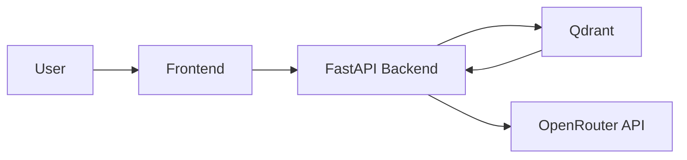

# DevDocs RAG

DevDocs RAG is a documentation question-answering application that indexes official documentation sources, embeds them into a vector database, and answers user questions by retrieving the most relevant chunks and grounding the response in the retrieved documentation.

The application is built around a FastAPI backend, a static Nginx frontend, and a Qdrant vector database. The Docker Compose setup is the recommended and default way to run the complete stack locally.

## Key features

- Documentation-focused retrieval over allowlisted official sources
- FastAPI backend for query handling and pipeline orchestration
- Nginx-served frontend for a simple chat interface
- Qdrant-based vector search for semantic retrieval
- Embedding generation with sentence-transformers and BGE models
- OpenRouter-powered response generation with citation validation
- Docker-first deployment using Compose
- SQLite cataloging and ingestion workflow for indexing documentation

## Architecture



The runtime flow is:

1. The user submits a question in the frontend.
2. The frontend calls the backend API.
3. The backend retrieves the most relevant document chunks from Qdrant.
4. The backend assembles the context and sends it to the OpenRouter model.
5. The model returns a grounded answer, and the backend validates citations against the retrieved source URLs.

## Tech stack

- Backend: FastAPI, Uvicorn
- Frontend: HTML, JavaScript, Nginx
- Vector database: Qdrant
- Embeddings: sentence-transformers / BGE
- LLM provider: OpenRouter
- Fetching and parsing: `httpx`, `beautifulsoup4`
- Configuration: `pydantic-settings`
- Containerization: Docker Compose
- Testing: `pytest`

## Docker images

The repository uses the following Docker images for deployment:

- Backend: `vineelkolli/devdocs-backend:latest` — [Docker Hub](https://hub.docker.com/r/vineelkolli/devdocs-backend)
- Frontend: `vineelkolli/devdocs-frontend:latest` — [Docker Hub](https://hub.docker.com/r/vineelkolli/devdocs-frontend)
- Qdrant: `qdrant/qdrant:latest` — [Docker Hub](https://hub.docker.com/r/qdrant/qdrant)

Responsibilities:

- Backend image: FastAPI/RAG backend
- Frontend image: Nginx-served frontend UI
- Qdrant image: vector database for stored embeddings and metadata

## Prerequisites

Before running the stack, ensure the following are available:

- Docker Desktop or Docker Engine
- Docker Compose
- Git
- A local `.env` file based on `.env.example`

The project uses `.env` for local environment configuration and `.gitignore` excludes it from source control.

## Quick start (Docker only)

This is the recommended way to run the complete application.

1. Clone the repository:

```bash
git clone https://github.com/vineel2805/ragchatbot.git
cd devdocs-rag
```

2. Create a local environment file:

```bash
cp .env.example .env
```

3. Configure `.env` with your local values. Use placeholders only, for example:

```env
OPENROUTER_API_KEY=your_api_key_here
OPENROUTER_MODEL=google/gemma-3-27b-it:free
QDRANT_URL=http://qdrant:6333
QDRANT_COLLECTION=devdocs_chunks
```

4. Pull the required images:

```bash
docker compose pull
```

5. Start the stack:

```bash
docker compose up -d
```

6. Verify the services are running:

```bash
docker compose ps
```

7. Open the application in a browser:

- Frontend: http://localhost
- Backend API: http://localhost:8000
- Qdrant: http://localhost:6333

To stop the stack:

```bash
docker compose down
```

## Configuration and environment variables

The backend configuration is defined in `backend/app/core/config.py` and loads values from `.env` using `pydantic-settings`.

The tracked example file is `.env.example`:

```env
APP_NAME=DevDocs API
APP_VERSION=0.1.0
ENVIRONMENT=development

QDRANT_URL=http://localhost:6333
QDRANT_COLLECTION=devdocs_chunks

OPENROUTER_API_KEY=
OPENROUTER_MODEL=google/gemma-3-27b-it:free
```

Important notes:

- `.env` should remain local and should not be committed
- `OPENROUTER_API_KEY` must be set in a local `.env` file before running the backend against the OpenRouter API
- `QDRANT_URL` and `QDRANT_COLLECTION` are used by the backend and the Docker Compose configuration

## Local development (optional)

Docker Compose is the primary setup for running the full app. Local Python development is also supported in the repository, but it is not required for normal use.

```bash
python -m venv .venv
source .venv/bin/activate  # or .\.venv\Scripts\Activate.ps1 on Windows
pip install -r backend/requirements.txt
```

Run tests from the repo root:

```bash
PYTHONPATH=backend python -m pytest backend/tests -q
```

## Useful Docker commands

```bash
docker compose up -d
docker compose ps
docker compose logs -f backend
docker compose logs -f frontend
docker compose pull
docker compose down
docker compose restart backend
```

## Project structure

```text
.
├── .env.example
├── .gitignore
├── docker-compose.yml
├── README.md
├── backend/
│   ├── Dockerfile
│   ├── requirements.txt
│   ├── run_ingestion.py
│   ├── app/
│   │   ├── api/
│   │   ├── core/
│   │   ├── generation/
│   │   ├── ingestion/
│   │   ├── rag/
│   │   ├── retrieval/
│   │   └── main.py
│   └── tests/
├── data/
│   ├── catalog/
│   ├── manifests/
│   ├── processed/
│   └── raw/
├── docs/
│   └── ingestion-design.md
├── frontend/
│   ├── Dockerfile
│   ├── app.js
│   ├── index.html
│   └── styles.css
├── qdrant_storage/
└── .venv/
```

## API endpoints

The FastAPI app is mounted under `/api/v1` in `backend/app/main.py`.

### Health

```http
GET /api/v1/health
```

Response:

```json
{
  "status": "healthy",
  "service": "devdocs-api"
}
```

### RAG query

```http
POST /api/v1/rag/query
```

Request body example:

```json
{
  "query": "How do I define a path parameter in FastAPI?",
  "source_id": "fastapi",
  "top_k": 10,
  "score_threshold": 0.0,
  "max_chunks": 5,
  "token_budget": 2000
}
```

The response returns the answer, citations, and metadata such as retrieved and in-context chunk counts. The route intentionally returns HTTP 200 even when the pipeline fails, and the client should inspect the `ok` field in the JSON body.

## Data persistence and Qdrant storage

The repository uses Docker volumes and local filesystem directories for stored state:

- Qdrant data: `./qdrant_storage:/qdrant/storage`
- Backend data: `./data:/app/data`
- Qdrant collection: `devdocs_chunks`

This means the indexed document vectors and cataloged ingestion metadata persist locally on disk until the repository is cleaned or the volumes are removed.

## Troubleshooting

### Backend cannot reach Qdrant

Check that the Qdrant container is running:

```bash
docker compose ps
```

Ensure `QDRANT_URL` matches the service name used by Docker Compose:

```env
QDRANT_URL=http://qdrant:6333
```

### OpenRouter requests fail

Verify that `OPENROUTER_API_KEY` is set in the local `.env` file and is not empty.

### Frontend cannot reach backend

Confirm that the backend container is active and that the frontend is calling `http://localhost:8000` (or a configured override).

### No answer is returned

This can happen when:

- no relevant chunks are found
- the score threshold filters everything out
- the OpenRouter call fails
- the source filter is too restrictive

The API returns a JSON error payload with `ok: false` instead of crashing the request.

## License

No license file was found in this repository, and no explicit license configuration is currently declared.

---

This README reflects the current repository implementation and Docker configuration. For questions about the ingestion flow or API behavior, the source files in `backend/app` and the Docker Compose definition are the source of truth.
